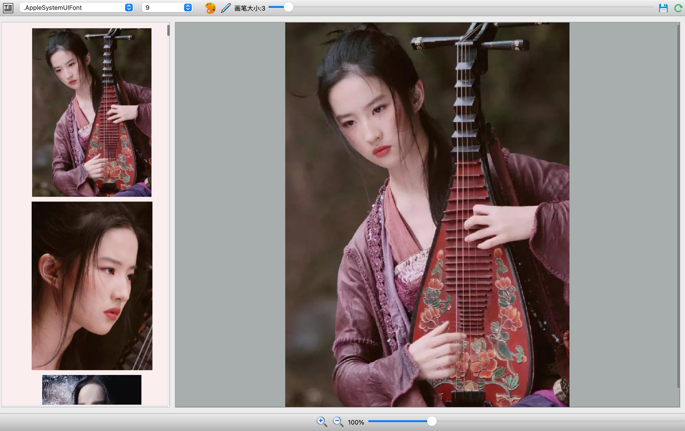

# 基于pyside6 图片浏览器GUI程序

这个项目是一个基于pysie6图片浏览器GUI程序，用户可以使用它来浏览、编辑和保存图片。编辑功能包括：缩放图像、绘制图像、添加文字等。

## 安装

首先你需要Python环境。你可以在[Python官网](https://www.python.org/downloads/)下载。

然后通过pip安装必要的依赖：

```shell
pip install -r requirements.txt
```

## 运行
```shell
python main.py
```

## 基本功能
- 浏览图片：你可以通过"文件"菜单或者滑动条来浏览图片。
- 编辑图片：你可以通过工具栏进行绘制和添加文字等操作。支持撤销和重做功能。
- 保存图片：你可以保存编辑后的图片到本地。

## 使用截图


## 反馈
如果你有任何想要改进的地方或者功能需求，欢迎提出issue或者提交pull request。